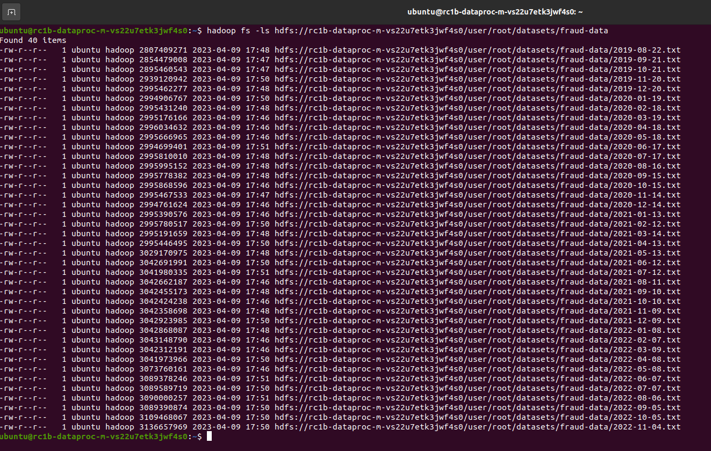

# Домашнее задание №2. Настройка облачной инфраструктуры для проекта по определению мошеннических транзакций

## 1. Объектное хранилище

Ссылка на публичное хранилище:

s3://inna-fraud-data/

https://inna-fraud-data.storage.yandexcloud.net/

## 2. Spark-кластер
Создан Spark-кластер в Data Proc с двумя подкластерами с требуемыми 
характеристиками

## 3. Копирование содержимого хранилища на HDFS
Снимок экрана с содержимым HDFS директории

## 4. Затраты
Стоимость кластера с заданной конфигурацией 40.75 руб/час (29 340 руб/мес).
При этом облачное хранилище аналогичного размера стоило бы около 800 руб/мес
(на основе калькулятора https://cloud.yandex.ru/prices#calculator).

## 5. Оптимизация
Можно немного уменьшить затраты на кластер, если поменять тип дисков на hdd.
Стоимость часа уменьшится до 35.46 руб, месяца - до 25 531 руб.

## 6. Kanban-доска
https://github.com/users/inna-tuzhikova/projects/2
