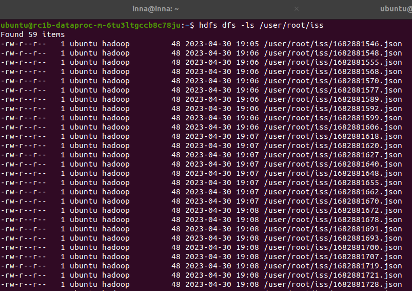

# 1. Описание
В домашнем задании генерируются данные (положение МКС) и копируются в HDFS. 
Автоматизировано с помощью Airflow - запуск раз в минуту

# 2. Кластер с dataproc
В Yandex Cloud создан кластер dataproc со следующими характеристиками:
 - Мастер-подкластер: класс хоста s3-c2-m8, размер хранилища 64 ГБ.
 - Data-подкластер: класс хоста s3-c2-m8, 1 хост, размер хранилища 64 ГБ.

# 3. Airflow
На мастер ноде установлен airflow 2.6.0

# 4. Код для airflow
[iss.py](iss.py)

DAG состоит из трёх тасков
 - iss_to_json - получение данных о позиции МКС и сохранение во временный json
 - json_to_hdfs - отправка json в HDFS
 - rm_json - удаление временного json файла

# 5. Скриншот

